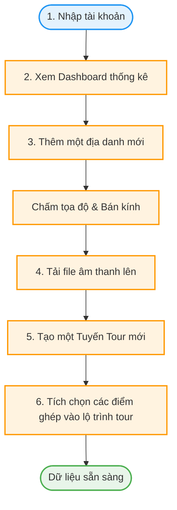
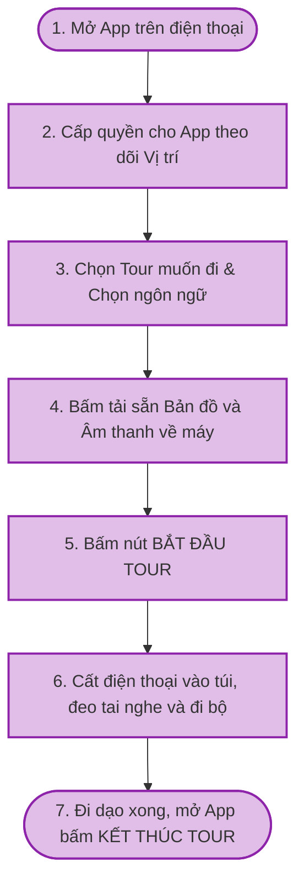
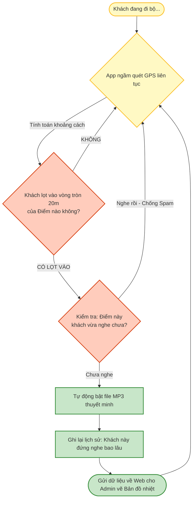
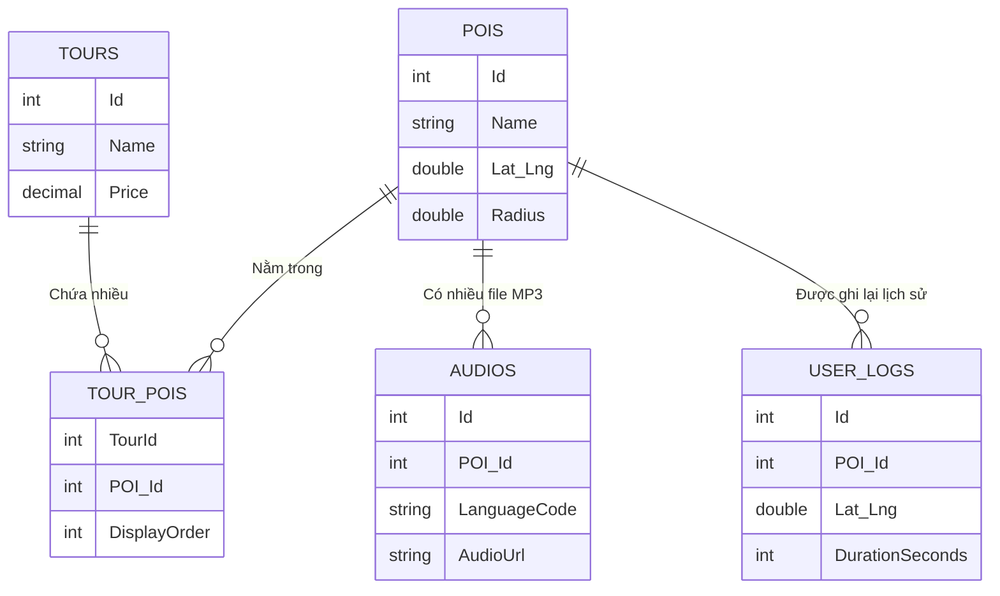

# Tổng quan về đồ án 
**Tên đồ án:** Ứng dụng Thuyết minh tự động điểm tham quan 
**Nền tảng:** Mobile App ( Android) & Web CMS (Admin)
**Mục tiêu :** Quảng bá về địa danh và cung cấp trải nghiệm tham quan tự động cho du khách. Khi người dùng đi dạo đến gần các điểm tham quan , ứng dụng sẽ tự động phát ra âm thanh và thuyết mình về địa danh

---

## 1. Chức năng cần có 

### 1.1. Ứng dụng di động (Dành cho Du khách)
*   **Bản đồ & Định vị (Map View):** 
    *   Hiển thị bản đồ tổng quan, vị trí hiện tại của người dùng .
    *   Hiển thị các điểm tham quan (POI) trên tuyến đường.
*   **Thuyết minh tự động (Geofencing & Narration):** 
    *   Tự động phát Audio thu sẵn hoặc Text-to-Speech (TTS) khi người dùng bước vào bán kính của một POI.
    *   Chống Spam: Không lặp lại một nội dung trong cùng một POI

### 1.2. Hệ thống Quản trị (Web Admin / CMS)
*   **Quản lý Điểm tham quan (POI):**
    *   Thêm/Sửa/Xóa POI.
    *   Thiết lập tọa độ (Latitude/Longitude), độ ưu tiên , bán kính kích hoạt (Radius).
*   **Quản lý Nội dung Đa ngôn ngữ (Content):**
    *   Nhập kịch bản (Script) hoặc Upload file Audio/Voiceover cho từng POI theo nhiều ngôn ngữ khác nhau.
*   **Quản lý Lộ trình (Tour Management):**
    *   Nhóm các POI lại thành một tuyến Tour cụ thể .
*   **Thống kê & Phân tích (Analytics):**
    *   Thống kê top địa điểm được nghe nhiều nhất, thời gian lưu lại trung bình.
    *   Bản đồ nhiệt (Heatmap) thể hiện vị trí người dùng hay tập trung.

---

## 2. LUỒNG HOẠT ĐỘNG CHÍNH (WORKFLOWS)

### 2.1. Luồng trải nghiệm của Du khách (User Journey)
1. **Khởi động:** Mở app, cấp quyền truy cập Vị trí (Luôn luôn / Always Allow).
2. **Chuẩn bị:** Chọn Tour muốn đi -> Tải dữ liệu Offline (Tùy chọn).
3. **Bắt đầu:** Nhấn "Bắt đầu", cất điện thoại và đi bộ tham quan.
4. **Trải nghiệm:** App chạy ngầm. Khi đến gần POI (VD: Tượng Phật), app tự động phát âm thanh giới thiệu.
5. **Kết thúc:** Hoàn thành lộ trình, nhấn "Kết thúc Tour". Khi có mạng, app đồng bộ lịch sử sử dụng lên hệ thống.

### 2.2. Sơ đồ Luồng Quản trị nội dung (Admin Workflow)
*(Mô tả cách Admin tạo dữ liệu để App có thể hoạt động)*

### 2.2. Luồng Khách Du Lịch (Thao tác trên App)
*Những gì khách du lịch bấm trên màn hình điện thoại trước khi cất vào túi.*

### 2.3. Luồng App Chạy Ngầm (Xử lý thông minh)
*Cách App tự động tính toán để bật âm thanh đúng lúc.*

---

## 3. CẤU TRÚC CƠ SỞ DỮ LIỆU (DATABASE SCHEMA)

Hệ thống được thiết kế với 5 bảng chính, đủ để đáp ứng mọi tính năng mà không bị rườm rà.

### Bảng chi tiết
1.  **Bảng `POIs` (Điểm tham quan):** Chứa thông tin cơ bản (Tên, Tọa độ Lat/Lng, Bán kính nhận diện, Ảnh minh họa).
2.  **Bảng `Audios` (File âm thanh):** Tách riêng khỏi bảng POIs để hỗ trợ đa ngôn ngữ (1 điểm POI có thể có 1 file Tiếng Việt, 1 file Tiếng Anh). Chứa đường dẫn file MP3.
3.  **Bảng `Tours` (Tuyến Tour):** Chứa thông tin tên Tour, lời giới thiệu và giá vé.
4.  **Bảng `TourPOIs` (Sắp xếp lộ trình):** Bảng nối giúp Admin gắp các điểm POI bỏ vào Tour và đánh số thứ tự (Điểm 1, Điểm 2...).
5.  **Bảng `UserLogs` (Lịch sử nghe):** Nơi nhận dữ liệu từ điện thoại gửi về (Khách đứng ở tọa độ nào, nghe bài gì, nghe bao lâu) để vẽ Bản đồ nhiệt.

### Sơ đồ quan hệ (ERD)

---
